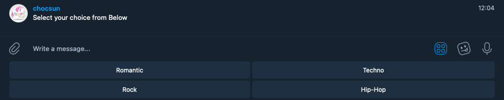
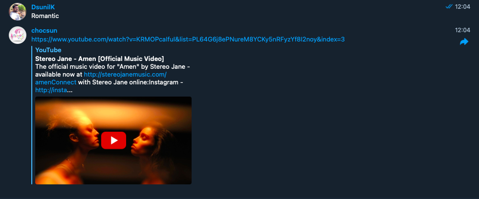

# Chocsun Bot

This project consist Telegram Bot, Which plays selected music of your choice from the gallery.

## Built With :

- [Ruby ](https://www.ruby-lang.org/en/)
- [GitHub](https://github.com/)
- [RSpec](https://rspec.info/)
- [Telegram ](https://telegram.org/)
- [telegram-bot-ruby](https://github.com/atipugin/telegram-bot-ruby)
- [linters](https://github.com/microverseinc/linters-config/tree/master/ruby)

## Issue page link

[Issue link](https://github.com/DsunilK/ruby-bot/issues)

## Video Explanation of Project

[Loom Video Link](https://www.loom.com/share/aba0ccdc5fde4479b7a3964f2abbff1c)

## 🔧 Getting Started

> To get started, follow below steps.

- Go to the main page of the repo.
- Press the "Code" button and get the repo link.
- Clone it using git clone.

### 📝 Setup

- Open a terminal
- Copy this code :
  `https://github.com/DsunilK/ruby-bot.git`
- Run the program with this code :
  `bundle install`
- Run the program with this code :
  `bin/main.rb`
- Stop the program with: "Ctrl + C" (Windows or Linux) or "Command + C"(Apple)

### 📝 How to interact with the bot?

- When the program is running on your terminal as mentioned in above step, please follow below steps.

- Search for in your browser: https://t.me/Chocsun_bot

- Click on Start it will take you to the telegram app

- Follow the instructions from your app screen.

## Authors

🧑‍💻 **Sunil Kumar**

- GitHub: [@DsunilK](https://github.com/DsunilK)
- Linkedin: [@DsunilK](https://www.linkedin.com/in/dsunilk/)
- Twiter: [@DsunilK](https://twitter.com/D_sunil_K)

## 🤝 Contributing

Contributions, issues and feature requests are welcome!
Feel free to check the issues page.

## Show your support ⭐️

Give a ⭐️ if you like this project!

## 📝 License

This project is MIT licensed.